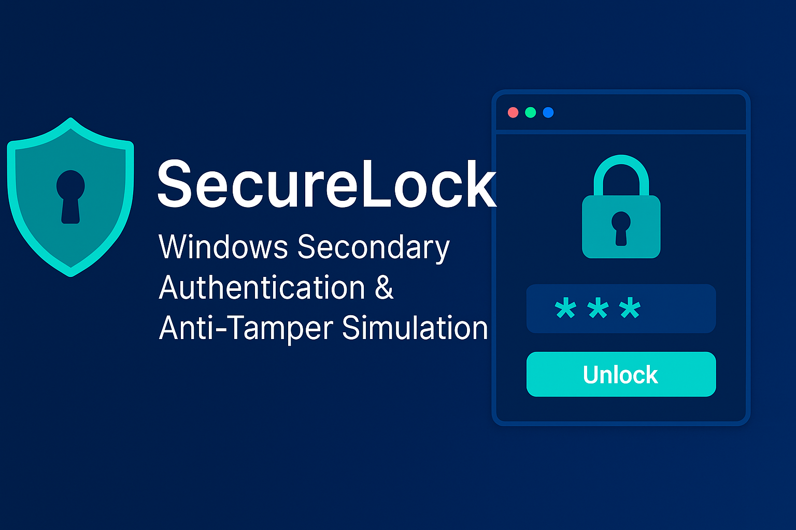

# SecureLock - Second layer of security

- A post-login security layer for Windows featuring password protection, recovery code.



## Overview

- SecureLock is an Windows security project that adds a secondary authentication layer immediately after the user logs in.
It is purpose to help the provide more security:

- Anti-tampering concepts
- Recovery mechanisms
- File-encryption
- Watch & monitoring the file
- Secure password storage

## GUI-based security workflows

- SecureLock runs after Windows login, displaying a full-screen password prompt.
- Until the correct secondary password is entered, the desktop remains locked.
- If the user enters incorrect credentials multiple times, SecureLock demonstrates a lockout response, including a recovery-code UI flow.

## Features

### Secondary Authentication

- Full-screen lock window after login
- Strong password enforcement
- Configurable password & recovery code
- Modern UI built using tkinter

### Anti-Tamper

- The watchdog monitors:
- Whether SecureLock is running
- Whether the config file is unchanged
- Whether authentication files are intact
- If tampering is detected, SecureLock is relaunched and a simulated lockout screen is shown.

### Recovery Code Mechanism

- During setup:
- A 16-character recovery code is generated
- User can save it to a text file
- Recovery code can unlock the system during simulated lockout

### Secure Storage

- Password and recovery code stored hashed (SHA-256)
- AES-based encryption using Fernet for secure storage
- No plaintext passwords saved

### Automatic Startup

#### Setup automatically:-

- Creates configuration
- Registers SecureLock watchdog in Task Scheduler
- Ensures SecureLock runs at every login

## Project Structure

```text
SecureLock/
│── setup.py                # First-time setup + password + recovery code
│── securelock.py           # Main lock  (GUI)
│── watchdog_service.py     # Anti-tamper watchdog + relaunch monitor
│── resources/              # Optional icons / UI assets
│── README.md               # Documentation
```

## How It Works (Execution Flow)

### 1.Run Setup

```bash
py setup.py
```

#### Setup performs:-

- Creates config + key

- Asks user to set a strong password

- Generates recovery code

- Saves encrypted credentials

- Registers watchdog in Task Scheduler

- Displays “Setup Complete”

### 2.Restart Windows

- At next login.

### 3.Watchdog Starts Automatically

#### Task Scheduler launches:-

- watchdog_service.exe

#### The watchdog:-

- Checks if SecureLock is running
- Detects tampering
- Restarts SecureLock if closed

### 4.SecureLock Launches the Lock Screen

- User must enter secondary password.

### 5.If Password Is Correct

- SecureLock creates temporary UNLOCKED.flag
- Watchdog detects it
- Desktop becomes accessible

### 6.If Password Is Incorrect 3 Times

- A lockout screen appears
- User may enter recovery code
- If recovery code matches, the files are “decrypted” and access is restored

## Installation Requirements

- Windows 10 or Windows 11
- Python 3.10+
- Required dependencies

## Author

- Bilal Shaikh
- GitHub:- [https://github.com/bilalshaikh-code](https://github.com/bilalshaikh-code)
